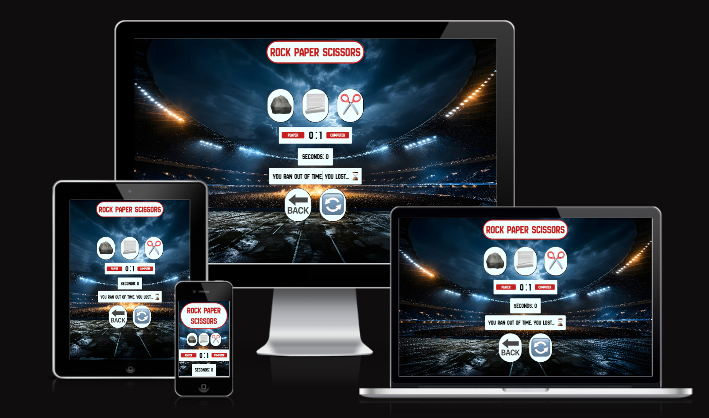
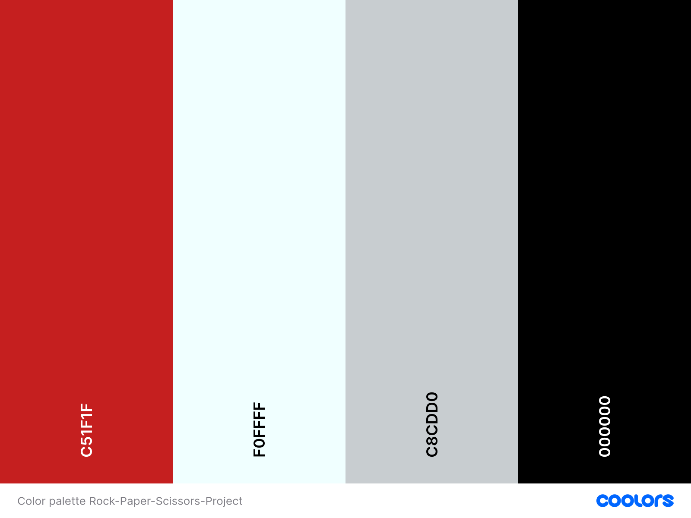
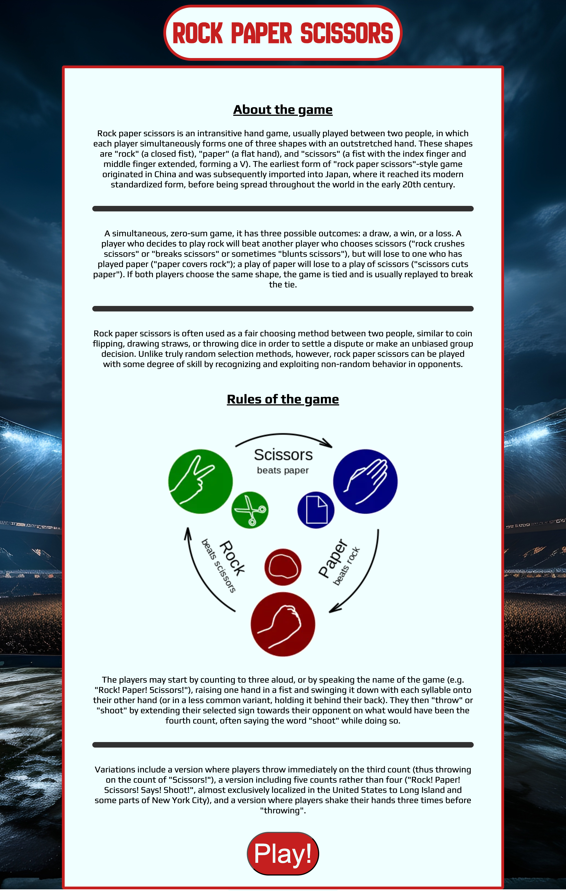
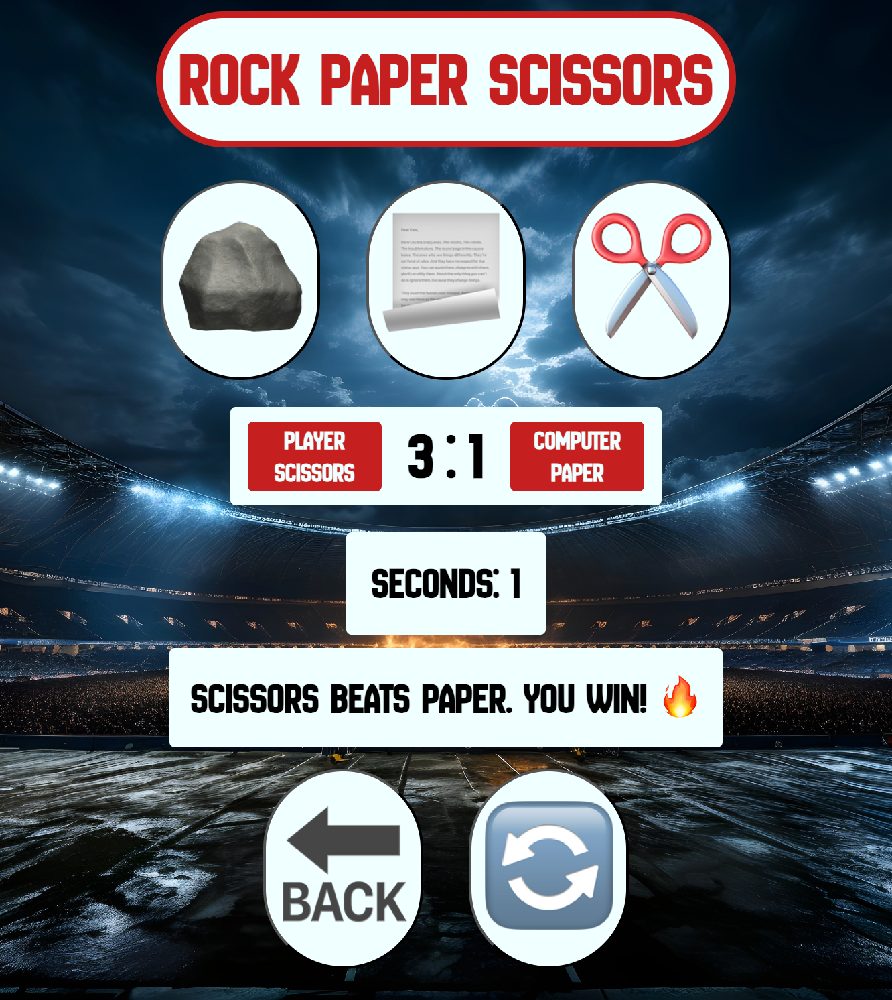
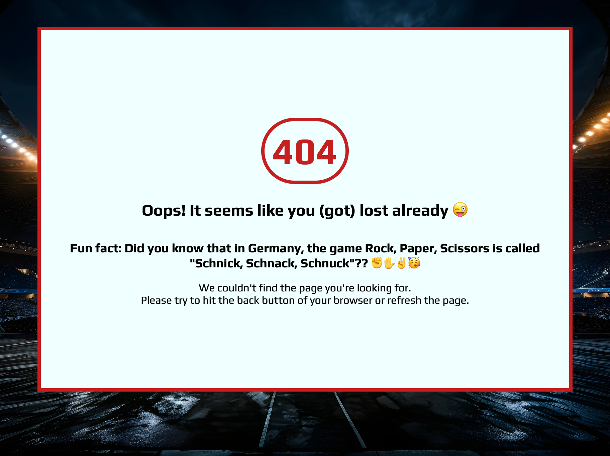

# [ROCK PAPER SCISSORS](https://maxcode0101.github.io/Rock_Paper_Scissors)

Name of the Project: Rock-Paper-Scissors

Rock-Paper-Scissors is an interactive browser based virtual intransitive hand game. My goal is to give the user the story about the creation of the game, as well as its background. Furthermore, I would like to convey that the game can be used to pass the time, as well as to make a decision, or as an alternative to flip a coin, for example. Above all, of course, the purpose is to design a browser application in which the user has fun playing rock, paper, scissors and has to try to defeat the computer.

https://ui.dev/amiresponsive?url=https://maxcode0101.github.io/Rock_Paper_Scissors 

## UX

I started designing the Game-Area-Section by thinking about what would be visually and interactively appealing for the user, imagining a virtual Rock-Paper-Scissors version. For me, it was important, that the shapes, colors and background match well, and transport a dynamic atmosphere which represents the application. So after choosing the arena-background, I went on with designing the color-scheme, and choosing the matching fonts. Afterward I decided to rather use emojis instead of pictures for the buttons, since this is more visually appealing from my point of view on the one hand, and offers some advantages from a performance point of view on the other. I went on with creating the Welcome-Section, which purpose is to transport the history about the game and it's rules. After the HTML and CSS was in place, I defined the functionality in JS.

### Colour Scheme

- `#C51F1F` used for primary text.
- `#F0FFFF` used for primary background.
- `#000000` used for secondary text.
- `#C8CDD0` used for secondary highlights.

I used [coolors.co] https://coolors.co/c51f1f-f0ffff-c8cdd0-000000 to generate my color-palette.

### Typography

- [New Amsterdam](https://fonts.google.com/specimen/New+Amsterdam) was used for the primary headers and titles.

- [Play](https://fonts.google.com/specimen/Play) was used for all other secondary text.

- [Font Awesome](https://fontawesome.com) icons were installed. Even if not used yet, I decided to keep it in place for upcoming improvement and implementing further features.

### Existing Features

- **Welcome Section**

    - Teaches the history about the creation of the game, as well as its background, and rules.

- **Game-Area-Section**

    - Contains the interactive area to play the game. This includes the arena-background, the buttons to choose from the options (Rock, Paper, Scissors) a score-tracker which counts the player & computer score, a timeout clock which counts down from three every round, an explanation who won/lost and why, a button to start the next round, and a back button to return to the welcome section.

- **404-Page**

    - In case that some technical issue occurs and the user can't connect with the requested page, a funny message is getting displayed. Furthermore, the user receives some advice how to navigate back to the welcome page.

### Future Features

One reason for doing this project, is the possibility of extension.

- Rock, Paper, Scissors, Lizard, Spock
    - It's thinkable to convert into the iconic variante Rock, Paper, Scissors, Lizard, Spock.
    https://static.wixstatic.com/media/903056_39aa9523c70a428684be9744580b0b1b~mv2.png/v1/fit/w_1000%2Ch_1000%2Cal_c/file.png

- Beast Mode
    - A "Beast Mode" could be included, which would contain a variante with 9, 11, 15 or even 25 gestures.
    https://retrohelix.com/2013/08/super-ultra-ultimate-rock-paper-scissors/

- Multiplayer
    - Modes for two-player or online-multiplayer with ranking system.

## Tools & Technologies Used

-  used to generate README and TESTING templates.
-  used for version control. (`git add`, `git commit`, `git push`)
-  used for secure online code storage.
-  used as a cloud-based IDE for development.
-  used for the main site content.
-  used for the main site design and layout.
-  used for user interaction on the site.
-  used for user interaction on the site.
-  used for hosting the deployed front-end site.
-  used for the icons.

## Deployment

The site was deployed to GitHub Pages. The steps to deploy are as follows:

- In the [GitHub repository](https://github.com/Maxcode0101/Rock_Paper_Scissors), navigate to the Settings tab 
- From the source section drop-down menu, select the **Main** Branch, then click "Save".
- The page will be automatically refreshed with a detailed ribbon display to indicate the successful deployment.

The live link can be found [here](https://maxcode0101.github.io/Rock_Paper_Scissors)

### Local Deployment

This project can be cloned or forked in order to make a local copy on your own system.

#### Cloning

You can clone the repository by following these steps:

1. Go to the [GitHub repository](https://github.com/Maxcode0101/Rock_Paper_Scissors) 
2. Locate the Code button above the list of files and click it 
3. Select if you prefer to clone using HTTPS, SSH, or GitHub CLI and click the copy button to copy the URL to your clipboard
4. Open Git Bash or Terminal
5. Change the current working directory to the one where you want the cloned directory
6. In your IDE Terminal, type the following command to clone my repository:
	- `git clone https://github.com/Maxcode0101/Rock_Paper_Scissors.git`
7. Press Enter to create your local clone.

Alternatively, if using Gitpod, you can click below to create your own workspace using this repository.

Please note that in order to directly open the project in Gitpod, you need to have the browser extension installed.
A tutorial on how to do that can be found [here](https://www.gitpod.io/docs/configure/user-settings/browser-extension).

#### Forking

By forking the GitHub Repository, we make a copy of the original repository on our GitHub account to view and/or make changes without affecting the original owner's repository.
You can fork this repository by using the following steps:

1. Log in to GitHub and locate the [GitHub Repository](https://github.com/Maxcode0101/Rock_Paper_Scissors)
2. At the top of the Repository (not top of page) just above the "Settings" Button on the menu, locate the "Fork" Button.
3. Once clicked, you should now have a copy of the original repository in your own GitHub account!

## Credits
### Content

| Source | Location | Notes |
| --- | --- | --- |
| [Markdown Builder](https://tim.2bn.dev/markdown-builder) | README and TESTING | tool to help generate the Markdown files |
| [Dev.to]https://dev.to/davidchedrick/creating-a-simple-timer-and-score-keeper-in-javascript-394g | Timer | creating a simple timer in Javascript |
| [Stackoverflow](https://stackoverflow.com/questions/5480945/refreshing-page-on-click-of-a-button) | Back-Button | use Method window.location.reload |
| [YouTube]https://www.youtube.com/watch?v=jaVNP3nIAv0&t=4657s | Game-Area-Section | tutorial - JavaScript, HTML, CSS - Rock Paper Scissors Game |
| [YouTube]https://www.youtube.com/watch?v=3uKdQx-SZ5A&t=346s | Game-Area-Section | tutorial - Build JavaScript ROCK PAPER SCISSORS in 18 minutes! |

### Media

| Source | Location | Type | Notes |
| --- | --- | --- | --- |
| [Wikipedia](https://en.wikipedia.org/wiki/Rock_paper_scissors) | Text about game-history and rules | image |on welcome-page|
| [Favicon.io](https://https://favicon.io/) | Favicon on all pages | favicon |
| [Freepik](https://www.freepik.com/free-ai-image/sports-stadium-with-lights-photography_72837697.htm) | Arena background | image |

### Acknowledgements

- I would like to thank my Code Institute mentor, [Tim Nelson](https://github.com/TravelTimN) for his support throughout the development of this project.
- I would like to thank the [Code Institute](https://codeinstitute.net) tutor team for their assistance with troubleshooting and debugging some project issues.
- I would like to thank the [Code Institute Slack community](https://code-institute-room.slack.com) for the moral support; it kept me going during periods of self doubt and imposter syndrome.
- I would like to thank my fellow Code Institute colleagues and Kay for their mental support, and sharing usefull tips and advices on day to day coding topics.
