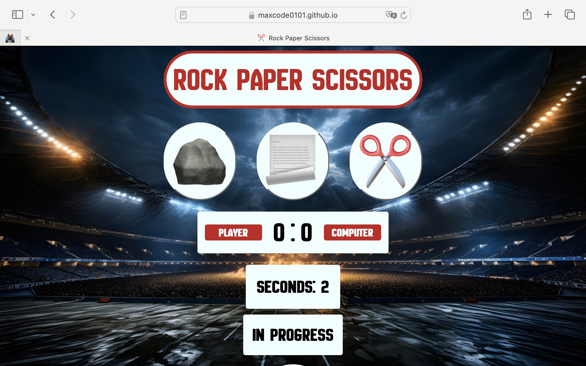

# Testing

> [!NOTE]  
> Return back to the [README.md](README.md) file.

Feature-by-Feature Testing:

I was navigating through all parts of the deployed application in desktop version on a Mac-Book Pro with the Chrome-Browser. I´ve tested if the transitions between the different sections (welcome-section; game-area-section) are smooth.

I scrolled up and down both sections and checked if it displays correct and all elements are in the right place with a good visibility.

I scrolled up and down the welcome-section and checked if it displays correct and all elements are in the right place with a good visibility.

I scrolled up and down the game-area and checked if it displays correct and all elements are in the right place with a good visibility.

I was testing the hover functions on the game-area.

I was testing all the clickable buttons.

I was testing if the timer, score-board, win/lose/draw, and result functions run and display correctly. 

I was testing if the 404 page displays and redirects to the home-page properly.

I opened the Dev-Tools in the Crome-Browser and repeated all of the steps above for all of the devices provided screen-sizes.

I opened the deployed website on my Iphone 13 Pro with Safari- and Chrome-Browser and repeated all the testings above.

During the Feature-by-Feature Testing no bugs have been encountered.

User Experience and Usability Testing:

I was sending the deployed link to two independent test-users.

Feedback-User1 (Iphone 8 with Safari Browser): No Problems encountered, it was fun to play the game." 

Feedback-User2 (Iphone Safari Browser): "The part about the game-history was interesting, the game was working without issues"

During the User-Testing no issues have been encountered.

Accessibility Testing: Confirm compliance with accessibility standards (e.g., screen reader compatibility, proper alt text for images, keyboard navigation).

I´ve used the hover function in the Chrome-Devtools to make sure the used background/font-color combination provides a good readability on the screen
----SCREENSHOT----

Compatibility Testing:

- Chrome-Browser

- Firefox Developer Edition

- Safari

Performance Testing:

Lighthouse
---Screenshot---

### HTML

I have used the recommended [HTML W3C Validator](https://validator.w3.org) to validate all of my HTML files.

| Directory | File | Screenshot | Notes |
| --- | --- | --- | --- |
|  | 404.html |  | |
|  | index.html |  | Minor warning because of missing heading (heading or div is in my opinion not necessary in this paricular case) |

### CSS

I have used the recommended [CSS Jigsaw Validator](https://jigsaw.w3.org/css-validator) to validate all of my CSS files.

| Directory | File | Screenshot | Notes |
| --- | --- | --- | --- |
| assets | style.css |  | |

### JavaScript

I have used the recommended [JShint Validator](https://jshint.com) to validate all of my JS files.

| Directory | File | Screenshot | Notes |
| --- | --- | --- | --- |
| assets | script.js |  | |

## Browser Compatibility

Browsers tested:
- [Chrome](https://www.google.com/chrome)
- [Firefox (Developer Edition)](https://www.mozilla.org/firefox/developer)
- [Safari](https://support.apple.com/downloads/safari)

I've tested my deployed project on multiple browsers to check for compatibility issues.

| Browser | Home | About | Contact | etc | Notes |
| --- | --- | --- | --- | --- | --- |
| Chrome |  |  |  | Works as expected |
| Firefox |  |  |  | Works as expected |
| Safari |  |  |  | Minor CSS differences |

## Responsiveness

I've tested my deployed project on multiple devices to check for responsiveness issues.

| Device | Home | About | Contact | etc | Notes |
| --- | --- | --- | --- | --- | --- |
| Mobile (DevTools) |  |  |  | Works as expected |
| Tablet (DevTools) |  |  |  |  Works as expected |
| Desktop |  |  |  | Works as expected |

## Lighthouse Audit

I've tested my deployed project using the Lighthouse Audit tool to check for any major issues.

| Page | Mobile | Desktop | Notes |
| --- | --- | --- | --- |
| Welcome & Game |  |  | No warnings |

## Bugs

- One unused ID-tag has been encountered during the HTML validation.  -The bug has been fixed-

- Some semicolons where missing in the JS.script and some global variables where unused. This was encountered during the Jshint validation. -The bugs have been fixed-

## Unfixed Bugs

I´m aware that the elements on the game-area might be a bit small for very large screens (4K Desktops and similar). I found it to be a problem of a very limited audience, as most users are going to access the page via Smartphone, Tablet, Laptop or normal screensized Desktop-Computer. The benefit ist to small to justify the effort in my opinion.

> [!NOTE]  
> There are no remaining bugs that I am aware of.
